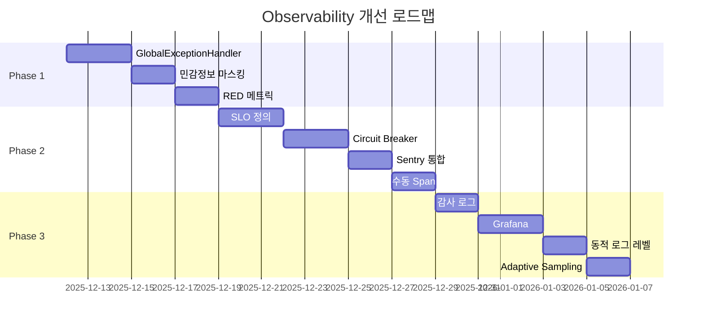

# OkChat Documentation

> **프로젝트**: OkChat AI Assistant
> **최종 업데이트**: 2025-12-12

---

## 📚 문서 목록

### Observability (관측성)

#### 1. [Observability 검토 및 개선 계획](observability-review.md)
**목적**: 현재 로깅, 에러 추적, 메트릭 현황 분석 및 엔터프라이즈 수준 개선 방안

**주요 내용:**
- 현황 분석 (강점 및 약점)
- 엔터프라이즈 표준과의 비교
- Phase별 개선 계획 (Phase 1~3)
- 예상 효과 (정량적/정성적)

**대상 독자**: 개발팀, 운영팀, CTO

---

#### 2. [Observability 구현 TODO](observability-todo.md)
**목적**: 단계별 구현 작업 추적 및 진행상황 관리

**주요 내용:**
- Phase 1: 기초 강화 (GlobalExceptionHandler, 민감정보 마스킹, RED 메트릭)
- Phase 2: 고급 기능 (SLO, Circuit Breaker, Sentry, Span)
- Phase 3: 엔터프라이즈 (감사 로그, Grafana, 동적 로그, Adaptive Sampling)
- 체크리스트 (54개 항목)

**대상 독자**: 개발자, 프로젝트 매니저

---

## 🚀 빠른 시작

### Phase 1 구현 (1-2주)

가장 먼저 구현해야 할 3가지:

1. **GlobalExceptionHandler** (3일)
   ```bash
   # 구현 위치
   src/main/kotlin/com/okestro/okchat/config/GlobalExceptionHandler.kt
   src/main/kotlin/com/okestro/okchat/exception/ErrorCode.kt
   src/main/kotlin/com/okestro/okchat/dto/ErrorResponse.kt
   ```

2. **민감정보 마스킹** (2일)
   ```bash
   # 구현 위치
   src/main/kotlin/com/okestro/okchat/config/SensitiveDataMaskingConverter.kt
   # 수정 파일
   src/main/resources/logback-spring.xml
   ```

3. **RED 메트릭 표준화** (2일)
   ```bash
   # 구현 위치
   src/main/kotlin/com/okestro/okchat/config/MetricsWebFilter.kt
   ```

### 문서 읽는 순서

1. **처음 읽는 사람**
   - `observability-review.md` 1장 (현황 분석)
   - `observability-review.md` 3장 (개선 계획 - Phase 1만)
   - `observability-todo.md` Phase 1 체크리스트

2. **구현 담당자**
   - `observability-todo.md` (해당 Phase 체크리스트)
   - `observability-review.md` (상세 구현 내용)

3. **운영/검토자**
   - `observability-review.md` Executive Summary
   - `observability-review.md` 5장 (예상 효과)

---

## 📊 현재 상태

### Observability 평가

| 영역 | 등급 | 상태 |
|------|------|------|
| 로깅 | ⭐⭐⭐ | 중급 - JSON 로깅, MDC 전파 우수 |
| 에러 추적 | ⭐ | 초급 - 전역 핸들러 필요 |
| 메트릭 | ⭐⭐⭐⭐ | 중고급 - 비즈니스 메트릭 우수 |
| 분산 추적 | ⭐⭐ | 초중급 - 기본 인프라만 |
| 보안 | ⭐ | 초급 - 감사 로그 부재 |

**종합**: 중급 수준 (엔터프라이즈 60% 충족)

### 개선 로드맵



---

## 🎯 예상 효과

### 정량적 효과

| 지표 | 현재 | 개선 후 | 향상 |
|------|------|---------|------|
| 장애 대응 시간 | 30분 | 15분 | 50% ⬇ |
| 에러 탐지율 | 90% | 99.5% | 10.5% ⬆ |
| 디버깅 시간 | 2시간 | 30분 | 75% ⬇ |
| 트레이싱 비용 | $500/월 | $65/월 | 87% ⬇ |
| 감사 대응 | 5일 | 0.5일 | 90% ⬇ |

### 정성적 효과

**개발팀:**
- ✅ 에러 원인 파악 시간 단축
- ✅ 표준화된 에러 처리
- ✅ 프로덕션 디버깅 스트레스 감소

**운영팀:**
- ✅ 실시간 대시보드
- ✅ Alert 자동화
- ✅ SLO 기반 배포 관리

**경영진:**
- ✅ 비즈니스 메트릭 실시간 확인
- ✅ 서비스 안정성 정량 보고
- ✅ 컴플라이언스 리스크 감소

---

## 🔗 관련 링크

### 외부 참고 자료

- [Google SRE Book - SLO](https://sre.google/sre-book/service-level-objectives/)
- [Prometheus Best Practices](https://prometheus.io/docs/practices/naming/)
- [OpenTelemetry Documentation](https://opentelemetry.io/docs/)
- [Grafana Dashboards](https://grafana.com/grafana/dashboards/)

### 프로젝트 리소스

- **Grafana**: http://localhost:3000 (개발 환경)
- **Prometheus**: http://localhost:9090 (개발 환경)
- **Jaeger**: http://localhost:16686 (개발 환경)

---

## 📞 문의

### 질문 및 이슈
- GitHub Issues
- Slack: #okchat-dev

### 코드 리뷰
- PR 생성 후 @team-lead 멘션

### 긴급 문의
- On-call 엔지니어

---

## 📝 문서 기여

문서 개선 제안:
1. 이슈 생성 또는 PR 제출
2. `docs/` 디렉토리에 마크다운 파일 추가
3. 이 README에 링크 추가

---

**문서 관리자**: [Your Name]
**마지막 업데이트**: 2025-12-12
