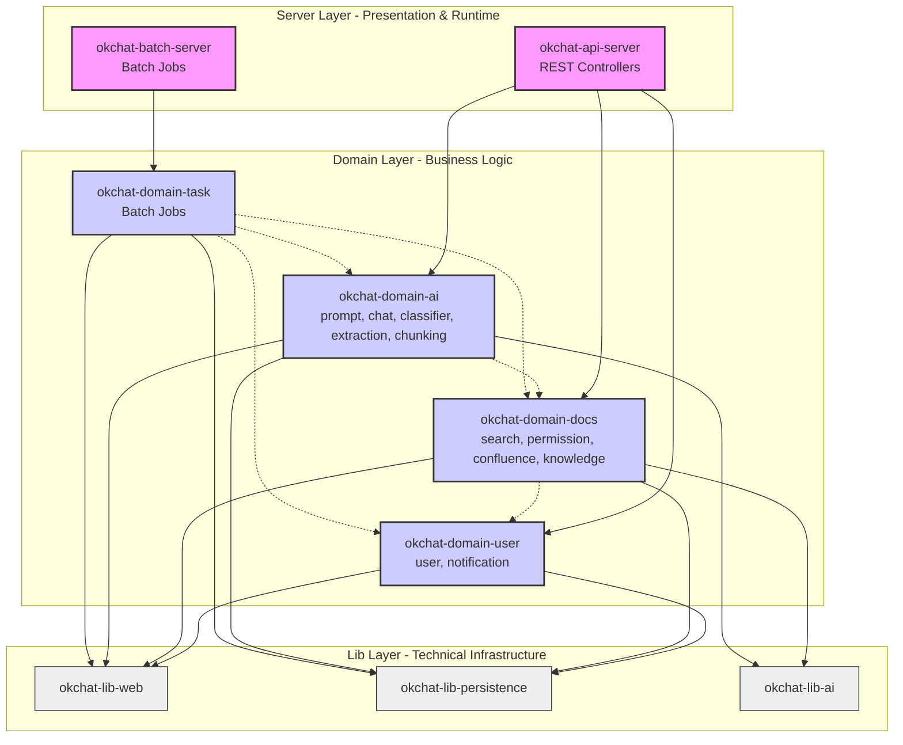

# 백엔드 모듈화 아키텍처 설계 보고서

## 1. 개요

본 보고서는 현재의 `okchat` 백엔드 모놀리스 서비스를 **모듈형 아키텍처(Modular Architecture)**로 전환하기 위한 상세 설계를 기술합니다. 이 설계는 향후 마이크로서비스 아키텍처(MSA)로의 원활한 전환을 고려하여 수립되었습니다.

핵심 목표는 서비스 간의 강한 결합을 끊고, 물리적으로 독립된 실행 환경을 구성할 수 있는 유연성을 확보하는 것입니다.

## 2. 핵심 설계 원칙

본 프로젝트는 다음의 4가지 핵심 원칙을 기반으로 수행됩니다.

1.  **도메인 완전 격리 (Domain Isolation with Zero Compile Dependency)**
    - 도메인 모듈 간의 직접적인 상호 참조를 컴파일 레벨에서 완전히 차단
    - 각 도메인은 독립적으로 빌드 및 배포 가능
    - 다른 도메인과의 통신은 오직 네트워크(HTTP/gRPC)를 통해서만 수행

2.  **공통 모듈 최소화 (Minimize Common Dependencies)**
    - 모든 모듈이 거대한 공통 모듈에 의존하는 현상을 방지
    - 기술적 라이브러리는 기능별로 세분화 (`lib-web`, `lib-persistence`, `lib-ai`)
    - 간단한 유틸리티나 DTO는 각 모듈 내부에 중복 정의 허용

3.  **API 계층 명확한 분리 (Clear API Layer Separation)**
    - **외부 API** (`/api/v1/*`): 프론트엔드용, Server 계층에 위치
    - **내부 API** (`/internal/api/v1/*`): 도메인 간 통신용, 각 Domain 계층에 위치
    - 내부 API는 향후 gRPC로 전환 가능하도록 설계

4.  **설정 기반 배포 전환 (Configuration-Based Deployment)**
    - 코드 변경 없이 설정만으로 모놀리스 ↔ 분산 서버 전환 가능
    - Feign Client의 URL을 설정 파일에서 관리
    - Phase별 점진적 마이그레이션 지원 (모놀리스 → 분리 → gRPC)

## 3. 목표 아키텍처 모델

프로젝트는 역할과 책임에 따라 크게 3가지 계층으로 구성됩니다.

### 3.1. 모듈 구성도

*   **okchat-root**
    *   **okchat-lib** (Tech Layer): 비즈니스 로직이 없는 순수 기술/설정 라이브러리
    *   **okchat-domain** (Business Layer): UseCase + Internal API + Client 포함, 완전 독립 실행 가능
    *   **okchat-server** (External API Layer): 외부 클라이언트(FE) 전용 REST API 제공

**[모듈 의존성 구조도]**



### 3.2. 각 도메인 모듈의 내부 구조

각 도메인 모듈은 독립적으로 실행 가능한 완전한 단위입니다:

**Level 0 도메인 예시 (독립 도메인)**

```
okchat-domain-user/
├── application/
│   └── usecase/              # 비즈니스 로직
│       ├── CreateUserUseCase.kt
│       └── GetUserUseCase.kt
├── model/
│   └── entity/              # 엔티티 및 Value Object
│       └── User.kt
├── repository/              # 리포지토리
│   └── UserRepository.kt
└── api/
    └── internal/             # 내부 API (다른 도메인용)
        └── UserInternalController.kt
            → 경로: /internal/api/v1/users/*
```

**Level 0 통합 도메인 예시 (user + notification + knowledge-member)**

```
okchat-domain-user/
├── user/                    # 서브 패키지: 사용자 관리
│   ├── application/usecase/
│   │   ├── CreateUserUseCase.kt
│   │   └── GetUserUseCase.kt
│   ├── model/entity/
│   │   └── User.kt
│   └── repository/
│       └── UserRepository.kt
├── notification/            # 서브 패키지: 이메일 알림
│   ├── application/usecase/
│   │   └── SendEmailUseCase.kt
│   ├── config/
│   │   └── EmailProperties.kt
│   └── provider/
│       └── EmailProvider.kt
├── knowledge-member/        # 서브 패키지: 지식베이스 멤버 관리
│   ├── application/usecase/
│   │   ├── AddKnowledgeBaseMemberUseCase.kt
│   │   └── GetKnowledgeBaseMembersUseCase.kt
│   ├── model/entity/
│   │   ├── KnowledgeBaseUser.kt
│   │   └── KnowledgeBaseEmail.kt
│   └── repository/
│       ├── KnowledgeBaseUserRepository.kt
│       └── KnowledgeBaseEmailRepository.kt
└── api/
    └── internal/            # 통합 내부 API
        ├── UserInternalController.kt
        ├── NotificationInternalController.kt
        └── KnowledgeMemberInternalController.kt
```

**Level 1 통합 도메인 예시 (docs)**

```
okchat-domain-docs/
├── search/                  # 서브 패키지: 문서 검색
│   ├── application/usecase/
│   ├── model/entity/
│   └── repository/
├── permission/              # 서브 패키지: 문서 권한
│   ├── application/usecase/
│   ├── model/entity/
│   └── repository/
├── confluence/              # 서브 패키지: Confluence 동기화
│   └── application/usecase/
├── knowledge/               # 서브 패키지: 지식베이스
│   ├── application/usecase/
│   ├── model/entity/
│   └── repository/
├── client/                  # 다른 도메인 호출용
│   └── UserClient.kt        # User 도메인 호출 (사용자 및 알림 포함)
└── api/
    └── internal/            # 통합 내부 API
        ├── DocsSearchInternalController.kt
        ├── DocsPermissionInternalController.kt
        └── DocsKnowledgeInternalController.kt
```

### 3.3. 의존성 정책

1.  **Server -> Domain**: Server 계층은 도메인의 UseCase만 사용 (외부 API 제공용)
2.  **Domain -> Lib**: 도메인 모듈은 오직 기술 라이브러리 모듈에만 의존
3.  **Domain -> Domain**: 다른 도메인 호출 시 HTTP Client(Feign) 사용, 컴파일 의존성 없음
4.  **Lib -> Lib**: 라이브러리 간의 참조는 최소화

## 4. API 계층 구분 및 통신 표준

### 4.1. 외부 API (External API) - 프론트엔드용

**위치**: `okchat-server` 모듈

```kotlin
// okchat-api-server/controller/ChatController.kt
@RestController
@RequestMapping("/api/v1/chats")  // 외부 API
class ChatController(
    private val sendMessageUseCase: SendMessageUseCase
) {
    @PostMapping("/messages")
    fun sendMessage(request: ExternalSendMessageRequest): ExternalMessageResponse {
        // 프론트엔드용 응답
        val result = sendMessageUseCase.execute(request.toInput())
        return ExternalMessageResponse.from(result)
    }
}
```

**특징**:
- 경로: `/api/v1/*`
- 프론트엔드 클라이언트 전용
- 인증/인가 필수
- API 버전 관리

### 4.2. 내부 API (Internal API) - 도메인 간 통신용

**위치**: 각 도메인 모듈 내부

```kotlin
// okchat-domain-user/api/internal/UserInternalController.kt
@RestController
@RequestMapping("/internal/api/v1/users")  // 내부 API
class UserInternalController(
    private val getUserUseCase: GetUserUseCase
) {
    @GetMapping("/{id}")
    fun getUser(@PathVariable id: Long): InternalUserResponse {
        // 다른 도메인이 호출
        val user = getUserUseCase.execute(id)
        return InternalUserResponse.from(user)
    }
}
```

**특징**:
- 경로: `/internal/api/v1/*`
- 다른 도메인 서비스 전용
- 내부 IP 대역에서만 접근 허용
- **향후 gRPC로 전환 예정**

### 4.3. 도메인 간 통신 패턴

**시나리오**: Chat 도메인이 User 도메인의 정보를 조회

```kotlin
// okchat-domain-chat/client/UserClient.kt
@FeignClient(name = "user-service", url = "\${internal.services.user.url}")
interface UserClient {
    @GetMapping("/internal/api/v1/users/{id}")
    fun getUser(@PathVariable id: Long): InternalUserResponse
}

// okchat-domain-chat/application/usecase/SendMessageUseCase.kt
@Service
class SendMessageUseCase(
    private val userClient: UserClient,  // HTTP 클라이언트
    private val messageRepository: MessageRepository
) {
    fun execute(input: SendMessageInput): SendMessageOutput {
        // 1. User 도메인 호출 (HTTP 통신)
        val user = userClient.getUser(input.userId)

        // 2. 비즈니스 로직 수행
        val message = Message.create(
            userId = user.id,
            content = input.content
        )

        messageRepository.save(message)
        return SendMessageOutput.from(message)
    }
}
```

### 4.4. 설정 기반 서버 분리

**Phase 1: 모놀리스 (같은 프로세스)**

```yaml
# application.yml
internal:
  services:
    user:
      url: http://localhost:8080  # 같은 서버
    search:
      url: http://localhost:8080
```

**Phase 2: 서버 분리**

```yaml
# application.yml
internal:
  services:
    user:
      url: http://user-service.internal:8080
    search:
      url: http://search-service.internal:8080
```

**Phase 3: gRPC 전환**

```kotlin
// UserClient 구현체만 교체
@Component
class UserGrpcClient : UserClient {
    override fun getUser(id: Long): InternalUserResponse {
        // gRPC stub 사용
        val response = userServiceStub.getUser(
            GetUserRequest.newBuilder().setId(id).build()
        )
        return InternalUserResponse.from(response)
    }
}
```

## 5. 중복 허용 정책

서버 간 완전 분리를 위해 다음과 같은 경우 코드 중복을 적극 허용합니다.

*   **Data Transfer Objects (DTO)** - 3가지 레벨:
    - **External DTO**: Server 계층의 외부 API용 (프론트엔드 계약)
    - **Internal DTO**: Domain 계층의 내부 API용 (도메인 간 통신 계약)
    - **UseCase DTO**: Domain 계층의 비즈니스 로직용 (내부 구현)
    - 위 3가지는 필드가 유사하더라도 별도로 정의하고 매핑
    - 한 계층의 변경이 다른 계층에 전파되는 것을 방지

*   **Client Interface & DTO**:
    - User 도메인을 호출하는 각 도메인(Chat, Knowledge 등)이 각자 `UserClient` 정의
    - 필요한 메서드와 DTO만 포함 (전체 User API를 복사할 필요 없음)
    - 공통 라이브러리로 만들면 컴파일 의존성 발생

*   **Simple Utilities**:
    - `StringUtils`, `DateUtils` 등은 각 모듈 내부에 복사
    - `common` 모듈로 만들면 모든 모듈이 의존하게 됨

*   **Value Objects**:
    - `Email`, `UserId` 같은 간단한 Value Object는 필요한 도메인마다 독립적으로 정의

## 6. 마이그레이션 실행 계획

전환 작업은 리스크 관리를 위해 단계적으로 수행됩니다.

### Phase 1: 기반 환경 구축
1.  멀티 모듈 프로젝트 구조 생성
2.  `okchat-lib` 하위 모듈 생성 및 기술 코드 이관
    - `okchat-lib-web`: Spring MVC, Feign Client, Validation 설정
    - `okchat-lib-persistence`: JPA, QueryDSL, Redis 설정
    - `okchat-lib-ai`: LLM 클라이언트, 프롬프트 관리

### Phase 2: 도메인 의존성 분석 및 마이그레이션 순서 결정

#### 2.1. 도메인 의존성 매핑

현재 코드베이스를 분석한 결과, 다음과 같은 의존성 구조가 확인되었습니다:

**Level 0: 독립 도메인 (다른 도메인 의존 없음)**
- `user`: 사용자 및 알림 통합 도메인
  - 하위: user (사용자 관리)
  - 하위: notification (이메일 알림 발송)
  - 하위: knowledge-member (지식베이스 멤버 관리: KnowledgeBaseUser, KnowledgeBaseEmail)
    - 누가 어떤 지식베이스에 접근 가능한지 관리
    - 지식베이스별 이메일 설정 관리

**Level 1: Level 0 의존**
- `docs`: 문서 및 지식베이스 통합 도메인
  - 하위: search (문서 검색, OpenSearch 연동)
  - 하위: permission (문서 권한 및 접근 제어)
  - 하위: confluence (Confluence 문서 동기화)
  - 하위: knowledge (지식베이스 자체 관리: KnowledgeBase, Document)
  - 의존: `user` (지식베이스 멤버 및 권한 정보 조회)
- `ai`: 대화형 AI 서비스 통합 도메인
  - 하위: prompt (프롬프트 관리)
  - 하위: chat (채팅 및 대화 관리, Pipeline 포함)
  - 하위: classifier (쿼리 분석 및 분류)
  - 하위: extraction (키워드, 타이틀, 위치 등 추출)
  - 하위: chunking (문서 청킹 전략)
  - 의존: `docs` (chat이 문서 검색, 권한 체크, 지식베이스 정보 사용)

**Level 2: 모든 레벨 의존**
- `task`: 배치 작업 및 스케줄링
  - 의존: `ai`, `user`, `docs`

#### 2.2. 마이그레이션 순서 (Bottom-Up 방식)

**Phase 2-1: Level 0 도메인 마이그레이션 (독립 도메인 우선)**

```
okchat-domain-user (사용자, 알림, 지식베이스 멤버 통합)
├── user (사용자 관리)
│   ├── UseCase, Entity, Repository 이관
│   └── Internal API: UserInternalController
├── notification (이메일 알림)
│   ├── UseCase, Service, Config 이관
│   └── Internal API: NotificationInternalController
└── knowledge-member (지식베이스 멤버 관리)
    ├── Entity: KnowledgeBaseUser, KnowledgeBaseEmail
    ├── Repository: KnowledgeBaseUserRepository, KnowledgeBaseEmailRepository
    ├── UseCase: AddKnowledgeBaseMemberUseCase, RemoveKnowledgeBaseMemberUseCase 등
    └── Internal API: KnowledgeMemberInternalController
```

- 도메인 모듈 디렉토리 생성
- 서브 패키지로 user, notification, knowledge-member 구성
- UseCase, Entity, Repository 이관
- knowledge-member는 "누가 접근 가능한가"만 관리 (지식베이스 내용은 docs 도메인)
- 통합 Internal API Controller 생성
- 단위 테스트 작성

**Phase 2-2: Level 1 도메인 마이그레이션**

```
우선순위 1:
okchat-domain-docs (문서 및 지식베이스 통합)
├── search (문서 검색, OpenSearch)
├── permission (문서 권한)
├── confluence (Confluence 동기화)
├── knowledge (지식베이스 관리)
├── Feign Client 추가: UserClient (사용자 및 알림 포함)
└── 통합 Internal API: DocsInternalController (search, permission, knowledge 통합 제공)

우선순위 2:
okchat-domain-ai (대화형 AI 서비스 통합)
├── prompt (프롬프트 관리)
├── chat (채팅, Pipeline 포함)
├── classifier (쿼리 분석)
├── extraction (정보 추출)
├── chunking (문서 청킹)
├── Feign Client 추가: DocsClient (search, permission, knowledge 포함)
└── 통합 Internal API: AiInternalController (chat, prompt 통합 제공)
```

**Phase 2-3: Level 2 도메인 마이그레이션**

```
okchat-domain-task
├── 배치 작업 이관
└── Feign Client 추가: AiClient, UserClient, DocsClient
```

#### 2.3. 각 Phase별 상세 작업

**공통 작업 (모든 도메인)**
1. 모듈 디렉토리 생성 및 `build.gradle.kts` 설정
2. Service → UseCase 리팩토링
3. Entity, Repository, Model 이관
4. 도메인 내부 단위 테스트 작성

**의존성이 있는 도메인 추가 작업**
1. 의존하는 도메인의 Internal API Controller 확인/생성
2. Feign Client 인터페이스 및 DTO 정의 (각 모듈 내부에)
3. UseCase에서 직접 참조 제거, Feign Client 사용으로 변경
4. 통합 테스트 (Mock Server 또는 Testcontainers 활용)

#### 2.4. 마이그레이션 위험 요소 및 대응 방안

**위험 요소 1: Docs 도메인의 User 의존성**
- 현재: Knowledge가 `UserRepository`를 직접 주입받아 사용
- 문제: DB 레벨 결합 (같은 트랜잭션, N+1 쿼리 등)
- 대응:
  ```kotlin
  // Before (컴파일 의존성)
  class CreateKnowledgeBaseUseCase(
      private val userRepository: UserRepository  // 직접 참조
  )

  // After (네트워크 통신)
  class CreateKnowledgeBaseUseCase(
      private val userClient: UserClient  // HTTP 호출 (사용자 및 알림 포함)
  )
  ```
- 주의: 트랜잭션 경계 변경, 성능 영향 검토 필요
- User 도메인이 사용자 관리와 알림을 통합 제공하므로 하나의 Client로 충분

**위험 요소 2: Chat Pipeline의 다중 도메인 의존**
- 현재: Pipeline Step에서 여러 도메인 Service 직접 호출
- 문제: 한 번의 채팅 요청에 여러 도메인 호출 → 네트워크 레이턴시 증가
- 대응:
  - Phase 1: Feign Client로 전환 (모놀리스 환경에서 성능 측정)
  - Phase 2: 비동기 호출 고려 (`suspend fun`)
  - Phase 3: 서버 분리 시 응답 시간 모니터링 및 최적화

**위험 요소 3: Task의 광범위한 의존성**
- 현재: 거의 모든 도메인에 의존
- 문제: Task는 배치 작업이므로 가장 마지막에 마이그레이션 필요
- 대응: Task 도메인은 Phase 2-4에서 처리, 다른 도메인이 안정화된 후 진행

**위험 요소 4: 순환 참조 가능성**
- 분석 결과: 현재는 순환 참조 없음
- 예방: Internal API 추가 시 역방향 호출이 생기지 않도록 주의

### Phase 3: Internal API 및 Client 구성

이 Phase는 Phase 2와 병행하여 진행됩니다. 각 도메인을 마이그레이션할 때 동시에 Internal API와 Client를 구성합니다.

#### 3.1. 실제 마이그레이션 예시: Knowledge → User 의존성 해결

**Before: 직접 Repository 의존**

```kotlin
// src/main/kotlin/com/okestro/okchat/knowledge/application/CreateKnowledgeBaseUseCase.kt
class CreateKnowledgeBaseUseCase(
    private val userRepository: UserRepository,  // 직접 의존
    private val knowledgeBaseRepository: KnowledgeBaseRepository
) {
    fun execute(input: CreateKnowledgeBaseUseCaseIn) {
        val user = userRepository.findById(input.userId)
            .orElseThrow { NotFoundException("User not found") }

        val knowledgeBase = KnowledgeBase.create(
            name = input.name,
            ownerId = user.id
        )
        knowledgeBaseRepository.save(knowledgeBase)
    }
}
```

**After: Feign Client 사용**

**Step 1: User 도메인에 Internal API 추가**

```kotlin
// okchat-domain-user/src/main/kotlin/api/internal/UserInternalController.kt
@RestController
@RequestMapping("/internal/api/v1/users")
class UserInternalController(
    private val getUserUseCase: GetUserUseCase
) {
    @GetMapping("/{id}")
    fun getUser(@PathVariable id: Long): InternalUserResponse {
        val user = getUserUseCase.execute(id)
        return InternalUserResponse(
            id = user.id,
            email = user.email,
            name = user.name
        )
    }
}

data class InternalUserResponse(
    val id: Long,
    val email: String,
    val name: String
)
```

**Step 2: Knowledge 도메인에 UserClient 추가**

```kotlin
// okchat-domain-knowledge/src/main/kotlin/client/UserClient.kt
@FeignClient(name = "user-service", url = "\${internal.services.user.url}")
interface UserClient {
    @GetMapping("/internal/api/v1/users/{id}")
    fun getUser(@PathVariable id: Long): UserDto
}

// Knowledge 모듈 내부의 DTO (User 도메인 DTO와 독립)
data class UserDto(
    val id: Long,
    val email: String,
    val name: String
)
```

**Step 3: UseCase에서 Client 사용**

```kotlin
// okchat-domain-knowledge/src/main/kotlin/application/CreateKnowledgeBaseUseCase.kt
class CreateKnowledgeBaseUseCase(
    private val userClient: UserClient,  // HTTP 클라이언트
    private val knowledgeBaseRepository: KnowledgeBaseRepository
) {
    fun execute(input: CreateKnowledgeBaseUseCaseIn) {
        val user = userClient.getUser(input.userId)  // HTTP 호출

        val knowledgeBase = KnowledgeBase.create(
            name = input.name,
            ownerId = user.id
        )
        knowledgeBaseRepository.save(knowledgeBase)
    }
}
```

#### 3.2. 복잡한 의존성 예시: Chat Pipeline

Chat 도메인은 여러 도메인에 의존하므로 더 복잡합니다:

```kotlin
// okchat-domain-chat/src/main/kotlin/pipeline/steps/DocumentSearchStep.kt

// Before: 직접 UseCase 의존
class DocumentSearchStep(
    private val multiSearchUseCase: MultiSearchUseCase  // search 도메인 직접 참조
) : DocumentChatPipelineStep {
    override suspend fun execute(context: ChatContext): ChatContext {
        val results = multiSearchUseCase.execute(...)
        return context.copy(search = SearchData(results = results))
    }
}

// After: Feign Client 사용
class DocumentSearchStep(
    private val searchClient: SearchClient  // HTTP 클라이언트
) : DocumentChatPipelineStep {
    override suspend fun execute(context: ChatContext): ChatContext {
        val results = searchClient.multiSearch(...)  // HTTP 호출
        return context.copy(search = SearchData(results = results))
    }
}
```

### Phase 4: External API 서버 구성
1.  `okchat-server` 하위 모듈 생성
    - `okchat-api-server`: 외부 REST API 서버 (프론트엔드용)
    - `okchat-batch-server`: 배치 작업 서버

2.  External Controller 구성
    - 기존 Controller를 `okchat-api-server`로 이관
    - 경로를 `/api/v1/*`로 변경 (외부 API)
    - 도메인의 UseCase를 주입받아 사용

### Phase 5: 통합 테스트 및 검증
1.  모놀리스 환경에서 테스트
    - 모든 서비스 URL을 `localhost:8080`으로 설정
    - 기존 기능과 동일하게 동작하는지 검증

2.  서버 분리 시뮬레이션
    - Docker Compose로 각 도메인을 별도 컨테이너로 실행
    - 내부 네트워크 통신 검증

---

## 7. 즉시 실행 가능한 첫 단계

현재 상태 분석 결과, 다음 순서로 시작하는 것을 권장합니다:

### Step 1: User 도메인 마이그레이션 (3~4일 소요 예상)

**이유**:
- 다른 도메인에 의존하지 않음 (독립 도메인, Level 0)
- Docs 도메인에서 필요로 함
- 사용자 관리, 알림, 지식베이스 멤버 관리를 통합

**작업 내용**:
1. `okchat-domain/okchat-domain-user` 모듈 구조 생성
2. 서브 패키지 구성:
   - `user`: 사용자 관리 (UseCase, Entity, Repository)
   - `notification`: 이메일 알림 (UseCase, Service, Config)
   - `knowledge-member`: 지식베이스 멤버 관리
     - KnowledgeBaseUser, KnowledgeBaseEmail Entity 이관
     - AddKnowledgeBaseMemberUseCase 등 멤버 관련 UseCase 이관
3. Internal API Controller 생성:
   - `UserInternalController`
   - `NotificationInternalController`
   - `KnowledgeMemberInternalController`
4. 통합 도메인 테스트

**책임 분리**:
- User 도메인: "누가" 지식베이스에 접근 가능한지 관리
- Docs 도메인: "무엇을" 지식베이스에 저장하는지 관리

### Step 2: Docs 도메인 마이그레이션 (4~5일 소요 예상)

**이유**:
- User 의존 (Level 1 도메인)
- AI 도메인에서 필요로 함 (search, permission, knowledge)
- Search는 이미 일부 파일이 AD 상태 (이관 작업 진행 중)
- 문서 및 지식베이스 내용 관리에 집중 (멤버 관리는 User로 이관됨)

**작업 내용**:
1. `okchat-domain/okchat-domain-docs` 모듈 구조 생성
2. 서브 패키지 구성:
   - `search`: 문서 검색 (OpenSearch), UseCase 및 Client 이관
   - `permission`: 문서 권한, Service → UseCase 전환
   - `confluence`: Confluence 동기화, Service 이관
   - `knowledge`: 지식베이스 자체 관리 (KnowledgeBase, Document 엔티티)
     - KnowledgeBaseUser, KnowledgeBaseEmail은 제외 (User 도메인으로 이관됨)
3. Feign Client 추가:
   - `UserClient` (사용자, 알림, 지식베이스 멤버 정보 조회)
4. Internal API Controller 생성:
   - `DocsSearchInternalController`
   - `DocsPermissionInternalController`
   - `DocsKnowledgeInternalController`
5. 도메인 내부 통합 테스트

**책임 분리 효과**:
- Knowledge 도메인이 단순화됨 (멤버 관리 로직 제거)
- User 도메인에서 통합적으로 멤버 관리 가능

### Step 3: AI 도메인 마이그레이션 (5~7일 소요 예상)

**이유**:
- Docs 의존 (Level 1 도메인)
- 대화형 AI 서비스 전체를 통합 (prompt, chat 포함)
- Chat Pipeline이 복잡하므로 충분한 시간 필요

**작업 내용**:
1. `okchat-domain/okchat-domain-ai` 모듈 구조 생성
2. 서브 패키지 구성:
   - `prompt`: 프롬프트 관리
   - `chat`: 채팅 및 Pipeline
   - `classifier`: 쿼리 분석
   - `extraction`: 정보 추출
   - `chunking`: 문서 청킹
3. Feign Client 추가:
   - `DocsClient` (search, permission, knowledge 포함)
4. Internal API Controller 생성:
   - `AiChatInternalController`
   - `AiPromptInternalController`
5. Chat Pipeline 통합 테스트

### Step 4: Task 도메인 마이그레이션 (2~3일 소요 예상)

모든 도메인이 완료된 후 진행. 배치 작업 이관.

**작업 내용**:
1. `okchat-domain/okchat-domain-task` 모듈 구조 생성
2. 배치 작업 이관 (ConfluenceSyncTask, EmailPollingTask, MetricsUpdateTask 등)
3. Feign Client 추가:
   - `AiClient`
   - `UserClient`
   - `DocsClient`
4. 스케줄링 설정 및 테스트

**예상 전체 일정**: 4~5주 (Phase 2~3 완료 기준)

**일정 상세**:
- Step 1 (User): 3~4일
- Step 2 (Docs): 4~5일
- Step 3 (AI): 5~7일
- Step 4 (Task): 2~3일
- 통합 테스트 및 버그 수정: 3~5일

---

## 8. 결론

본 설계를 통해 `okchat` 서비스는 다음과 같은 이점을 확보합니다:

### 8.1. 완전한 도메인 격리
- 각 도메인 모듈은 **컴파일 타임 의존성 제로**
- 다른 도메인과의 통신은 오직 HTTP/gRPC를 통해서만 수행
- 한 도메인의 변경이 다른 도메인에 영향을 주지 않음

### 8.2. 즉시 분리 가능한 구조
- 설정 파일의 URL만 변경하면 서버 분리 완료
- Docker Compose, Kubernetes 등 어떤 환경에도 배포 가능
- 각 도메인을 독립적으로 스케일링 가능

### 8.3. 단계적 프로토콜 전환
- **Phase 1**: 모놀리스 환경에서 HTTP 통신으로 시작
- **Phase 2**: 도메인별 서버 분리
- **Phase 3**: 내부 API를 gRPC로 전환하여 성능 최적화
- Client 구현체만 교체하면 되므로 비즈니스 로직 변경 없음

### 8.4. 명확한 API 계층 분리
- **외부 API** (`/api/v1/*`): 프론트엔드용, 버전 관리
- **내부 API** (`/internal/api/v1/*`): 도메인 간 통신용, gRPC 전환 대상

### 8.5. 실행 가능한 마이그레이션 계획
- 도메인 간 의존성을 완전히 분석하여 Bottom-Up 방식으로 마이그레이션
- Level 0 (user) → Level 1 (docs, ai) → Level 2 (task) 순서로 안전하게 진행
- 각 단계별 구체적인 코드 예시와 위험 요소 대응 방안 제시
- 도메인 통합과 책임 분리를 통한 관리 복잡도 최소화 (10+ 모듈 → 4개 통합 도메인):
  - **user**: user, notification, knowledge-member 통합
    - "누가" 시스템을 사용하고, "누구에게" 알림을 보내며, "누가" 지식베이스에 접근 가능한지 관리
  - **docs**: search, permission, confluence, knowledge 통합
    - "무엇을" 저장하고, 검색하고, 동기화하는지 관리
  - **ai**: prompt, chat, classifier, extraction, chunking 통합
    - AI 기반 대화 및 분석 기능 통합
  - **task**: 배치 작업 및 스케줄링

이는 향후 트래픽 증가나 비즈니스 확장에 따라 특정 도메인을 독립 서비스로 분리하거나, 고성능 통신 프로토콜로 전환하는 작업을 최소 비용으로 수행할 수 있는 기반이 됩니다. 통합 도메인 구조는 관련 기능을 논리적으로 그룹화하고 명확한 책임 분리를 통해 관리 효율성을 높이면서도, 필요 시 하위 패키지를 독립 모듈로 분리할 수 있는 유연성을 제공합니다.
