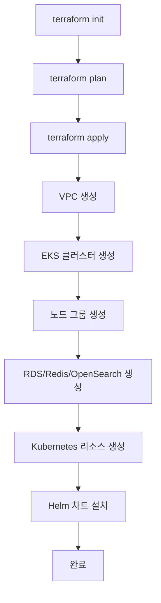

# Terraform 구현 사항 정리

최신 구현 내용과 기술적 세부사항을 정리한 문서입니다.

## 📋 구현 개요

**버전**: 1.3.0  
**마지막 업데이트**: 2025-10-07  
**목적**: 비용 최적화된 AWS 개발 환경 구축

## 🎯 적용된 시나리오

### 시나리오 3: Spot 인스턴스 + 비용 최적화 (권장)

**월 예상 비용**: $174-179

**주요 특징**:
- ✅ Spot 인스턴스로 70-90% 비용 절감
- ✅ ARM Graviton2 인스턴스 사용 (20% 추가 절감)
- ✅ 단일 AZ 배포 (Multi-AZ 비용 제거)
- ✅ 단일 NAT Gateway (50% 비용 절감)
- ✅ VPC Endpoints로 데이터 전송 비용 절감
- ✅ 불필요한 기능 비활성화

## 🏗 인프라 구성

### 파일 구조

```
terraform/
├── main.tf                  # 메인 엔트리포인트
├── providers.tf             # Provider 설정
├── variables.tf             # 변수 정의 (29개)
├── locals.tf                # 환경 변수 매핑 ⭐
├── outputs.tf               # 출력 값 (20개)
│
├── vpc.tf                   # VPC, 서브넷, NAT, VPC Endpoints
├── security_groups.tf       # 4개 Security Groups
├── iam.tf                   # IRSA 역할 (3개)
├── secrets.tf               # Secrets Manager, 비밀번호 생성
│
├── eks.tf                   # EKS 클러스터, 노드 그룹
├── rds.tf                   # RDS MySQL
├── elasticache.tf          # Redis 클러스터
├── opensearch.tf           # OpenSearch 도메인
├── ecr.tf                   # ECR 레포지토리
│
├── kubernetes.tf            # K8s 리소스 (7개)
│
├── terraform.tfvars.example # 설정 예제
├── .gitignore              # Git 제외 파일
│
├── scripts/
│   ├── deploy.sh           # 자동 배포 스크립트
│   └── destroy.sh          # 자동 정리 스크립트
│
├── scenarios/
│   ├── scenario-4-single-replica.tfvars
│   └── README.md
│
├── README.md               # 메인 문서
├── QUICK_START.md         # 빠른 시작
└── IMPLEMENTATION.md      # 이 문서
```

### 리소스 카운트

| 카테고리 | 리소스 수 |
|---------|----------|
| VPC & 네트워크 | ~25 |
| EKS & 노드 | ~15 |
| 데이터베이스 | ~10 |
| IAM & 보안 | ~8 |
| Kubernetes | 7 |
| **총계** | **~65** |

## 🔧 기술적 세부사항

### 1. VPC 및 네트워크 (vpc.tf)

**VPC**:
- CIDR: 10.0.0.0/16
- DNS Hostname/Support: 활성화

**서브넷**:
```hcl
Public:   10.0.0.0/24, 10.0.1.0/24
Private:  10.0.10.0/24, 10.0.11.0/24
Database: 10.0.20.0/24, 10.0.21.0/24
```

**NAT Gateway**:
- 단일 NAT Gateway (비용 절감)
- Public 서브넷 [0]에 위치

**VPC Endpoints** (비용 절감):
- ECR API/DKR
- CloudWatch Logs
- STS
- S3 Gateway

### 2. EKS 클러스터 (eks.tf)

**클러스터**:
- 버전: 1.31
- 엔드포인트: Public + Private
- 로깅: audit, api

**애드온**:
- coredns (최신)
- kube-proxy (최신)
- vpc-cni (최신)
- aws-ebs-csi-driver (최신)

**노드 그룹**:
```hcl
capacity_type: SPOT          # 70-90% 절감
instance_types: [t3.medium]
desired_size: 2
min_size: 1
max_size: 3
disk: 30GB gp3
```

**Helm 차트**:
- AWS Load Balancer Controller 1.8.0
- Metrics Server 3.12.0

### 3. RDS MySQL (rds.tf)

**스펙**:
- 엔진: MySQL 8.0
- 인스턴스: db.t4g.micro (ARM Graviton2)
- 스토리지: 20GB gp3, 최대 50GB
- Multi-AZ: false (비용 절감)
- 백업: 3일

**파라미터**:
```hcl
character_set_server: utf8mb4
collation_server: utf8mb4_unicode_ci
lower_case_table_names: 1
max_connections: 2048
wait_timeout: 3600
max_allowed_packet: 64MB
```

### 4. ElastiCache Redis (elasticache.tf)

**스펙**:
- 엔진: Redis 7.1
- 노드: cache.t4g.micro (ARM Graviton2)
- 노드 수: 1
- AZ: single-az (비용 절감)
- 백업: 1일

**파라미터**:
```hcl
maxmemory-policy: allkeys-lru
timeout: 300
```

### 5. OpenSearch (opensearch.tf)

**스펙**:
- 버전: OpenSearch 2.11
- 인스턴스: t3.small.search
- 노드 수: 1
- EBS: 20GB gp3
- 암호화: 전송 중 + 저장 시

**보안**:
- Fine-grained access control
- HTTPS 강제
- TLS 1.2+

### 6. ECR (ecr.tf)

**설정**:
- 이미지 스캔: 활성화
- 암호화: AES256
- Mutability: MUTABLE

**라이프사이클**:
- 태그된 이미지: 최근 10개 유지
- 태그 없는 이미지: 7일 후 삭제

### 7. IAM (iam.tf)

**IRSA 역할**:
1. **EBS CSI Driver**: PV 관리
2. **AWS Load Balancer Controller**: ALB/NLB 생성
3. **External Secrets Operator**: Secrets Manager 접근

**정책**:
- 최소 권한 원칙
- OIDC Provider 기반 인증

### 8. Kubernetes 리소스 (kubernetes.tf)

**리소스**:
1. Namespace: okchat
2. ConfigMap: okchat-config (환경 변수)
3. Secret: okchat-secret (민감 정보)
4. Deployment: okchat-app (Replicas: 1-2)
5. Service: okchat-app (ClusterIP)
6. Service: okchat-app-headless
7. Ingress: ALB
8. HPA: CPU/메모리 기반

**Deployment 설정**:
```yaml
replicas: var.app_replica_count (기본 2)
image: ECR URL
resources:
  requests: 1Gi/500m
  limits: 3Gi/2000m
probes:
  liveness: /actuator/health/liveness
  readiness: /actuator/health/readiness
```

**HPA 설정**:
```yaml
min: var.hpa_min_replicas (기본 2)
max: var.hpa_max_replicas (기본 5)
metrics:
  - CPU: 70%
  - Memory: 80%
```

## 🔐 환경 변수 매핑 (locals.tf)

### ConfigMap (비민감 정보)

```hcl
app_config = {
  # Spring Application
  SPRING_APPLICATION_NAME = "ok-chat"
  
  # Database
  SPRING_DATASOURCE_URL = "jdbc:mysql://${RDS_ENDPOINT}/okchat?..."
  SPRING_DATASOURCE_DRIVER_CLASS_NAME = "com.mysql.cj.jdbc.Driver"
  
  # Redis
  SPRING_DATA_REDIS_HOST = ${REDIS_ENDPOINT}
  SPRING_DATA_REDIS_PORT = "6379"
  
  # OpenSearch
  SPRING_AI_VECTORSTORE_OPENSEARCH_HOST = ${OPENSEARCH_ENDPOINT}
  SPRING_AI_VECTORSTORE_OPENSEARCH_PORT = "443"
  SPRING_AI_VECTORSTORE_OPENSEARCH_SCHEME = "https"
  SPRING_AI_VECTORSTORE_OPENSEARCH_INDEX_NAME = "vector_store"
  
  # Spring AI
  SPRING_AI_OPENAI_EMBEDDING_MODEL = "text-embedding-3-small"
  SPRING_AI_OPENAI_CHAT_OPTIONS_MODEL = "gpt-4.1-mini"
  
  # Task
  SPRING_CLOUD_TASK_ENABLED = "true"
  TASK_CONFLUENCE_SYNC_ENABLED = "false"
  TASK_EMAIL_POLLING_ENABLED = "false"
  
  # Hikari
  SPRING_DATASOURCE_HIKARI_MAXIMUM_POOL_SIZE = "10"
  SPRING_DATASOURCE_HIKARI_MINIMUM_IDLE = "2"
}
```

### Secret (민감 정보)

```hcl
app_secrets = {
  # Database
  SPRING_DATASOURCE_USERNAME = var.rds_master_username
  SPRING_DATASOURCE_PASSWORD = random_password.rds_password.result
  MYSQL_ROOT_PASSWORD = random_password.rds_password.result
  
  # OpenAI
  OPENAI_API_KEY = var.openai_api_key
  
  # OpenSearch
  SPRING_AI_VECTORSTORE_OPENSEARCH_USERNAME = var.opensearch_master_user
  SPRING_AI_VECTORSTORE_OPENSEARCH_PASSWORD = random_password.opensearch_password.result
  
  # Confluence (optional)
  CONFLUENCE_BASE_URL = var.confluence_base_url
  CONFLUENCE_EMAIL = var.confluence_email
  CONFLUENCE_API_TOKEN = var.confluence_api_token
  
  # Gmail (optional)
  EMAIL_PROVIDERS_GMAIL_USERNAME = var.gmail_username
  EMAIL_PROVIDERS_GMAIL_OAUTH2_CLIENT_ID = var.gmail_oauth2_client_id
  EMAIL_PROVIDERS_GMAIL_OAUTH2_CLIENT_SECRET = var.gmail_oauth2_client_secret
}
```

## 🔄 주요 수정 사항

### 해결된 오류들

1. **ElastiCache 엔드포인트 참조 오류** ✅
   - 문제: 모듈 출력 구조 복잡
   - 해결: 직접 리소스 생성 (`aws_elasticache_cluster`)

2. **OpenSearch 엔드포인트 참조 오류** ✅
   - 문제: 모듈 출력 형식 불명확
   - 해결: 직접 리소스 생성 (`aws_opensearch_domain`)

3. **Kubernetes Secret 이중 인코딩** ✅
   - 문제: `base64encode()` 중복 적용
   - 해결: `tostring()` 사용

4. **MySQL 초기화 스크립트 파일 없음** ✅
   - 문제: 파일이 없을 때 오류
   - 해결: 조건부 리소스 생성 (`fileexists()`)

5. **IAM 역할 ARN 참조 오류** ✅
   - 문제: EKS 모듈 출력 직접 접근 불가
   - 해결: Data source 추가 (`data.aws_iam_role`)

## 📊 변수 목록

### 필수 변수

| 변수 | 타입 | 기본값 | 설명 |
|------|------|--------|------|
| openai_api_key | string | - | OpenAI API Key (필수) |

### 선택 변수 (기본값 있음)

| 카테고리 | 변수 수 | 주요 변수 |
|---------|---------|-----------|
| 프로젝트 | 3 | project_name, environment, aws_region |
| VPC | 2 | vpc_cidr, availability_zones |
| EKS | 8 | cluster_version, node_instance_types, capacity_type |
| 애플리케이션 | 3 | app_replica_count, hpa_min/max_replicas |
| RDS | 7 | instance_class, allocated_storage |
| Redis | 4 | node_type, engine_version |
| OpenSearch | 5 | instance_type, ebs_volume_size |
| 시크릿 | 7 | confluence, gmail (선택사항) |

## 🚀 배포 플로우



**소요 시간**: 20-30분

## 🔍 검증 체크리스트

### 배포 후 확인

```bash
# 1. Terraform 출력
terraform output

# 2. EKS 클러스터
aws eks describe-cluster --name okchat-dev
kubectl get nodes

# 3. RDS
aws rds describe-db-instances --db-instance-identifier okchat-dev-mysql

# 4. Redis
aws elasticache describe-cache-clusters --cache-cluster-id okchat-dev-redis

# 5. OpenSearch
aws opensearch describe-domain --domain-name okchat-dev

# 6. Kubernetes
kubectl get all -n okchat
kubectl get ingress -n okchat
kubectl get hpa -n okchat

# 7. 애플리케이션
kubectl logs -f deployment/okchat-app -n okchat
```

## 💡 최적화 포인트

### 이미 적용된 최적화

1. ✅ **Spot 인스턴스**: 70-90% 비용 절감
2. ✅ **ARM Graviton2**: 20% 추가 절감
3. ✅ **단일 AZ**: Multi-AZ 비용 제거
4. ✅ **단일 NAT**: 50% NAT 비용 절감
5. ✅ **VPC Endpoints**: 데이터 전송 비용 절감
6. ✅ **작은 인스턴스**: t3/t4g micro/small 사용
7. ✅ **불필요 기능 비활성화**: Performance Insights, Auto-Tune

### 추가 최적화 가능

1. **업무 시간만 운영**: 추가 $20-30/월 절감
2. **Karpenter**: 더 나은 Spot 관리
3. **Cluster Autoscaler**: 노드 자동 스케일링
4. **Reserved Instances**: 장기 사용 시 30-60% 절감

## 🔐 보안 구현

1. **네트워크 격리**
   - Private 서브넷에 워크로드 배포
   - Security Group으로 최소 접근

2. **암호화**
   - EBS: 저장 시 암호화
   - RDS: 저장 시 암호화
   - OpenSearch: 전송 중 + 저장 시 암호화
   - Secrets: AWS Secrets Manager

3. **IAM**
   - IRSA로 Pod별 권한 분리
   - 최소 권한 원칙

4. **인증/인가**
   - OpenSearch Fine-grained access control
   - EKS RBAC

## 📈 확장 가능성

### 프로덕션 전환 시 고려사항

1. **고가용성**
   - Multi-AZ 활성화
   - RDS/Redis/OpenSearch Multi-AZ
   - NAT Gateway 추가

2. **성능**
   - 인스턴스 크기 증가
   - Read Replica 추가
   - Cache 계층 최적화

3. **모니터링**
   - CloudWatch Container Insights
   - Prometheus + Grafana
   - X-Ray 트레이싱

4. **백업/DR**
   - 백업 보관 기간 증가
   - Cross-Region 복제
   - 재해 복구 계획

---

**작성**: DevOps Team  
**버전**: 1.3.0  
**마지막 업데이트**: 2025-10-07